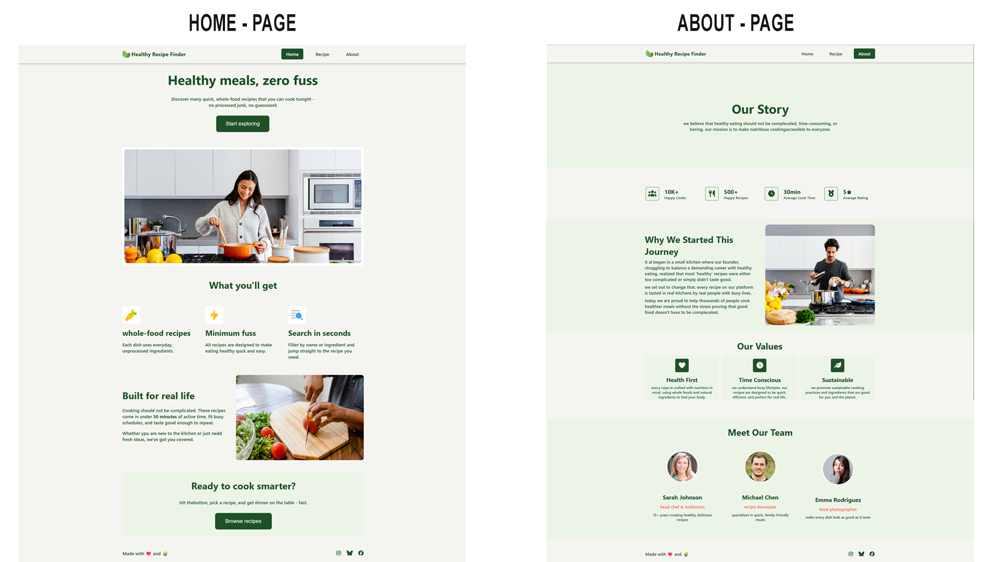
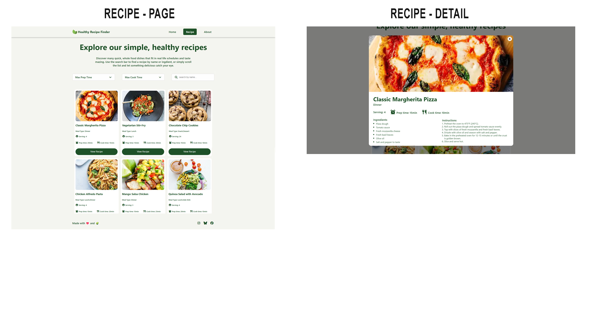
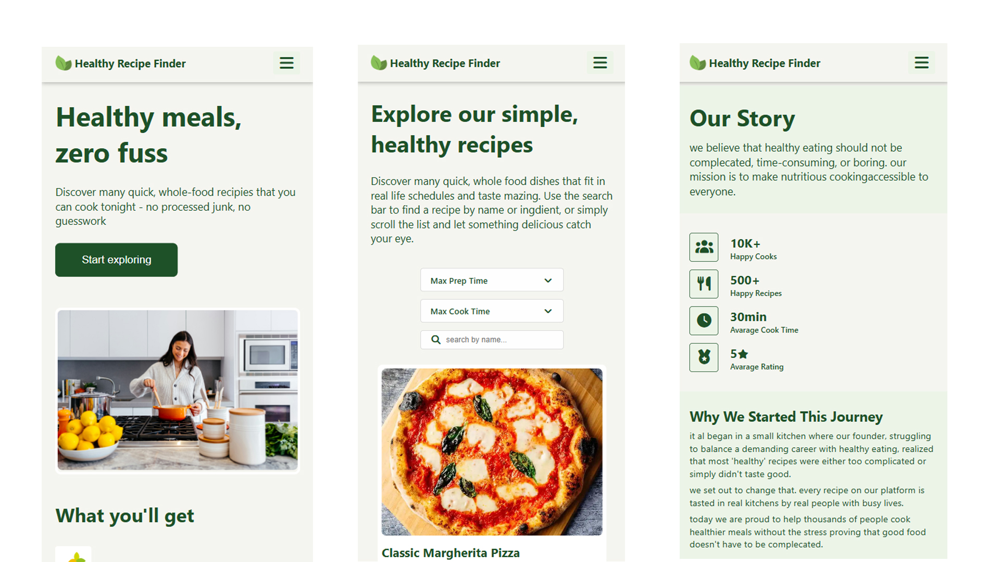

# healthy-recipe-finder
A multi‑page recipe finder built with HTML, CSS, and vanilla JavaScript. This website allows users to search recipes by name and apply filters (e.g., cuisine type, ingredients, or dietary preferences). Designed with a clean UI and responsive layout.

✨ Features

- 🔍 **Search recipes** by keywords
- 🧩 **Filter recipes** by categories (e.g., vegetarian, quick meals, cuisine type)
- 📄 **Multi‑page navigation** for browsing recipes and viewing details
- 📱 **Responsive design** for mobile, tablet, and desktop
- 🎨 Styled with **CSS for accessibility and readability**
- ⚡ Built with **vanilla JavaScript** (no external libraries)

🚀 How It Works

1. Enter a recipe name in the search bar.
2. Apply filters to narrow down results.
3. Browse through recipe cards across multiple pages.
4. Click a recipe to view detailed instructions and ingredients.

---
### desktop view

### desktop view - recipe page

---
### mobile view

